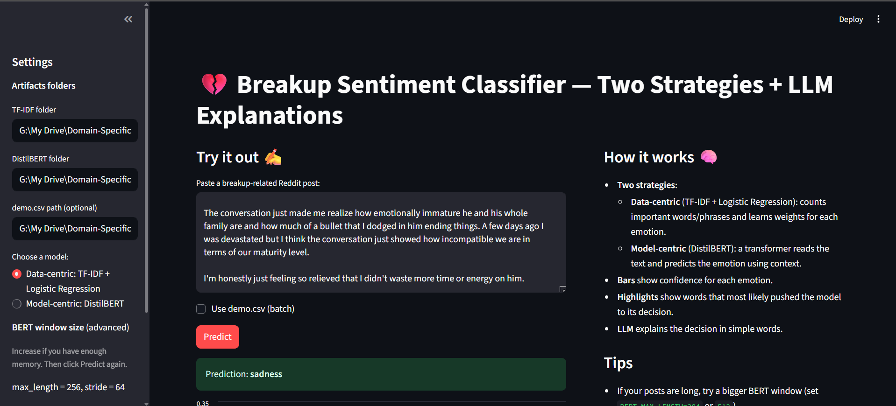
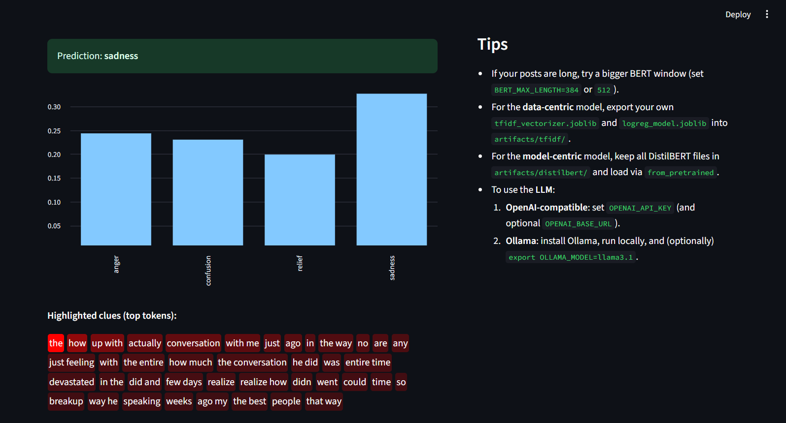
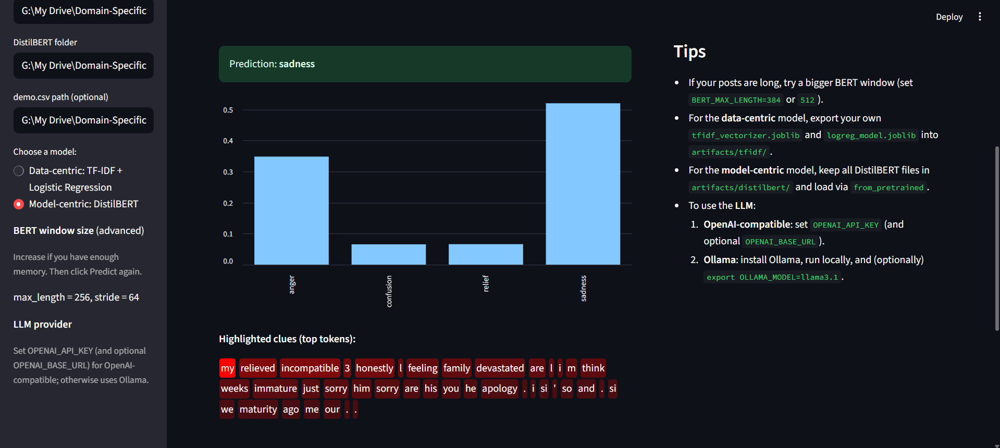

# 💔 Domain-Specific Sentiment Analysis for Reddit Break-Ups  
*(Low-Resource NLP + LLM Explanations)*

This project builds a **real-world NLP system** that classifies emotions in Reddit breakup posts and explains predictions using a **local LLM (Ollama)**.

The system compares two strategies:
- **Data-centric:** TF-IDF + Logistic Regression  
- **Model-centric:** DistilBERT fine-tuned on low-resource breakup data  

A **Streamlit web app** lets users paste text and see:
- Emotion prediction  
- Confidence scores  
- Important tokens  
- **LLM-generated natural language explanation**

---

## 🚀 Why this project is unique

Most sentiment models are trained on generic data (tweets, reviews).  
Break-up posts use **emotional, informal, and domain-specific language**.

This project shows how to build **high-accuracy NLP models in low-resource domains** using:
- Smart data augmentation  
- TF-IDF n-grams  
- Transformer fine-tuning  
- LLM-based explanation layer  

---

## 🧠 Emotions predicted

The system predicts **four emotions**:

| Emotion | Meaning |
|--------|--------|
| Anger | Frustration, resentment |
| Confusion | Uncertainty, mixed feelings |
| Relief | Emotional release |
| Sadness | Grief, heartbreak |

---

## 🧩 System Architecture

User Input
↓
TF-IDF / DistilBERT Model
↓
Probability Scores + Token Importance
↓
Ollama LLM (LLaMA 3.1)
↓
Human-Readable Explanation


---

## 🖥 Web App (Streamlit)

The UI provides:
- Emotion probabilities
- Token-level highlights
- LLM-generated explanations

This makes the model **interpretable and human-friendly**.

---

## 🛠 Tech Stack

- Python  
- Scikit-learn  
- HuggingFace Transformers  
- PyTorch  
- Streamlit  
- Ollama (LLaMA 3.1)

---

## 📸 Demo







## ▶️ How to run locally

### 1️⃣ Install dependencies
```bash
pip install -r requirements.txt
2️⃣ Start Ollama
bash
ollama serve
Make sure a model is installed:

bash
ollama pull llama3.1
3️⃣ Run the app
bash
streamlit run breakup_sentiment_ui_app.py
Open:

http://localhost:8501
```

## 📈 What this demonstrates
This project shows skills in:

Low-resource NLP

Feature engineering (TF-IDF n-grams)

Transformer fine-tuning

Model explainability

LLM integration

Building ML web apps

This mirrors how real AI products are built in companies.

👩‍💻 Author
Amrit Kaur

Minor Degree in AI & Data Science (IIT Mandi × Masai)

Aspiring ML Engineer / Data Scientist
